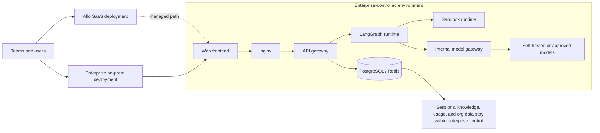
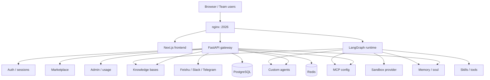

# Allo（元枢）

[](./backend/pyproject.toml)
[](./Makefile)
[](./LICENSE)

Allo is a web-based AI workspace and team-oriented SaaS for research, coding, analysis, and content creation. It combines chat threads, knowledge bases, custom agents, a marketplace, and admin controls with an extensible agent runtime built for both cloud delivery and enterprise on-premise deployment.

Allo is designed for organizations that want a polished web product without giving up deployment control. You can run it as a SaaS-style platform, or deploy the full stack inside your own environment — from models and runtime services to storage, gateway, and workflow execution — to meet data privacy, compliance, and internal governance requirements.


## Deployment and privacy at a glance



## Table of Contents

- [What is Allo](#what-is-allo)
- [Why teams choose Allo](#why-teams-choose-allo)
- [Core Product Surface](#core-product-surface)
  - [Chats and work modes](#chats-and-work-modes)
  - [Knowledge bases](#knowledge-bases)
  - [Custom agents](#custom-agents)
  - [Marketplace](#marketplace)
  - [Admin and team operations](#admin-and-team-operations)
- [SaaS and team foundations](#saas-and-team-foundations)
- [Enterprise deployment and data privacy](#enterprise-deployment-and-data-privacy)
- [Agent platform capabilities](#agent-platform-capabilities)
- [Architecture](#architecture)
- [Quick Start](#quick-start)
  - [Local development](#local-development)
  - [Docker development](#docker-development)
  - [Production-style Docker deployment](#production-style-docker-deployment)
- [Development commands](#development-commands)
- [Repository structure](#repository-structure)
- [License](#license)

## What is Allo

Allo is designed for two audiences at the same time:

- **Teams and operators** who want a web-based AI workspace with accounts, organizations, knowledge, admin controls, and extensibility.
- **Developers and self-hosters** who want the full stack behind that product: frontend, API gateway, agent runtime, sandbox integration, skills, MCP, memory, and channels.

In practice, Allo gives you:

- A multi-surface web workspace for long-running AI work
- Organization-scoped data and session-based authentication
- Agent orchestration with planning, reasoning, tools, and sub-agents
- Extensible skills and MCP-based tool integration
- Knowledge base ingestion and retrieval
- Deployment paths for both managed SaaS delivery and enterprise-controlled infrastructure

## Why teams choose Allo

Allo sits between a simple chat app and a fully fragmented internal AI stack.

It gives teams one product surface for:

- Multi-step AI work instead of only one-off prompts
- Shared knowledge and reusable agents instead of isolated chats
- Admin visibility and organization-level controls instead of personal-only usage
- Extensibility through skills, tools, and MCP instead of a fixed assistant
- Enterprise deployment choices when privacy, network isolation, or compliance matter

For companies with stricter requirements, the important point is not only that Allo has product features. It is that the system can be deployed as a complete stack under enterprise control.

## Core Product Surface

### Chats and work modes

The workspace is organized around persistent chat threads and agent runs. Users can switch between three interaction styles:

- **Autonomous**: default end-to-end execution style for complex tasks
- **Precise**: more controlled interaction style for higher-guidance workflows
- **Express**: faster execution style for shorter feedback loops

All three modes keep planning, reasoning, and sub-agent orchestration enabled. The difference is in interaction style and runtime budget rather than feature gating.

Other thread-level capabilities include:

- Multi-model selection
- Reasoning effort selection for supported models
- File uploads into thread-scoped storage
- Artifact access for generated files
- Follow-up suggestion generation
- Knowledge-base-aware chat context

### Knowledge bases

Allo includes organization-scoped knowledge bases for grounding agent work.

Available capabilities include:

- Create, list, update, and delete knowledge bases
- Upload documents up to 50 MB
- Convert supported files into Markdown for downstream retrieval
- Trigger indexing when needed instead of embedding everything eagerly
- Search by keyword and semantic retrieval
- Read processed content and download original files

This makes the knowledge system usable both as a product feature and as infrastructure for domain-grounded agents.

### Custom agents

Teams can define their own agents instead of relying only on a single default assistant.

Custom agent capabilities include:

- Name availability checks and validation
- Create, read, update, and delete custom agents
- Agent-specific model selection
- Agent-specific tool-group configuration
- Editable `SOUL.md` persona / behavior definition
- Dedicated chat entry points for agent-specific conversations

This allows product teams to package repeatable workflows as named agents inside the same workspace.

### Marketplace

Allo includes a marketplace surface for installing reusable skills and tools.

Current marketplace capabilities include:

- Browse public tools and public skills
- Install and uninstall items at the organization scope
- Auto-install public marketplace items for newly created organizations
- Keep organization-level installed item records
- Upload custom `.zip` or `.skill` archives
- Re-upload custom skills with overwrite behavior
- Delete user-uploaded custom skills
- Apply user-level enable / disable toggles on top of the final skill catalog

This gives Allo both a curated distribution model and a user-customization path.

### Admin and team operations

Allo already exposes product-facing administration surfaces rather than only developer APIs.

Current admin and team capabilities include:

- Platform usage summary endpoints
- Organization member listing, addition, and removal
- Organization-scoped usage summary endpoints
- Admin dashboard pages and organization views
- Usage record tracking across authenticated requests

The repository also contains the foundations for broader governance flows, including provider key management, organization-aware administration, and usage visibility that can be carried forward into stricter SaaS controls.

## SaaS and team foundations

Allo is not just an agent demo UI. The codebase already contains the core application primitives needed for a SaaS-style product:

- **Authentication and sessions**: email/password registration, login, logout, cookie-backed sessions, and authenticated session inspection
- **Organizations**: users belong to organizations, and product data is scoped by `org_id`
- **Tenant configuration foundations**: the data model already includes organization-scoped configuration records
- **User profiles**: per-user profile information and locale handling
- **Usage tracking**: middleware records authenticated request activity into usage records
- **Provider key management**: user API key management endpoints provide the basis for BYOK-style deployments
- **Marketplace installs**: tools and skills can be installed per organization
- **Channels**: Feishu, Slack, and Telegram integrations can be managed from the backend service layer

For public-facing product descriptions, the right summary is:

- Allo already supports the core product surfaces expected from a team AI workspace.
- It also includes the technical foundation for deeper BYOK, governance, tenant configuration, and usage-management workflows.

## Enterprise deployment and data privacy

Allo is suitable not only for hosted SaaS delivery, but also for enterprise-controlled deployment.

### What can be deployed under enterprise control

The repository already supports self-hosting of the full application stack:

- Web frontend
- API gateway
- LangGraph-based runtime service
- nginx reverse proxy
- PostgreSQL-backed application data
- Redis-assisted session and cache flows
- Sandbox-related runtime components
- Local or container-oriented service orchestration

In practical terms, this means enterprises can keep the application plane inside their own environment instead of routing product traffic through a third-party hosted control plane.

### Model and service deployment flexibility

Allo is also structured so that enterprises can control the model side of the stack.

You can:

- Configure your own model providers in `config.yaml`
- Point to OpenAI-compatible gateways through `base_url`
- Use enterprise-managed model relays or internal model services
- Keep workflow services, storage, and model access in the same controlled environment

This is the core privacy story for Allo: the product can be delivered as SaaS, but it is not locked to SaaS-only operation.

### Data privacy positioning

For privacy-sensitive teams, the key value is deployment control.

Allo is built so organizations can:

- Keep user sessions, organizational data, knowledge files, and usage records under their own infrastructure control
- Run the application behind their own network boundary
- Use self-selected models and model gateways
- Avoid forcing business data through a vendor-hosted product stack when internal policy does not allow it

If your requirement is “web product experience, but enterprise-controlled data path,” that is a supported direction for this codebase.

## Agent platform capabilities

Under the web product, Allo still exposes a broad agent platform.

### Skills

Skills are structured capability modules that can be bundled, installed, enabled, disabled, and distributed.

Allo supports:

- Built-in public skills
- Marketplace-managed skills
- User-uploaded custom skills
- User-level skill toggles
- Progressive skill loading through the underlying runtime model

### MCP

Allo includes user-scoped MCP configuration management.

This includes:

- Named MCP server definitions
- `stdio` and remote-style configuration fields
- Header and environment configuration
- OAuth-related configuration fields such as token URL, client credentials, refresh token, scope, and audience

### Memory and soul

Allo separates reusable personal context from transient thread state.

- **Memory** stores reusable long-term context
- **Soul** stores persona / behavior shaping content for the user
- The runtime preloads memory, soul, knowledge-base references, and skill catalog state before execution

### Sandbox, uploads, and artifacts

Allo supports file-centric agent workflows rather than chat-only interactions.

- Upload files into thread-scoped storage
- Convert supported office files into Markdown
- Sync uploads into the runtime-visible sandbox path when needed
- Expose generated files and artifacts through HTTP endpoints
- Read packaged skill contents through artifact routes

### Planning and sub-agents

The underlying runtime is built for multi-step work, not only single-turn chat.

It supports:

- Plan-mode execution contexts
- Interaction-style aware runs
- Sub-agent enablement in thread context
- Recursive execution budgets
- Long-running task orchestration through LangGraph-based flows

## Architecture

Allo is a full-stack system with a web product layer and an agent runtime layer.

### Stack

- **Frontend**: Next.js 16, React 19, TypeScript
- **Gateway**: FastAPI
- **Agent runtime**: LangGraph-based runtime and the internal `deerflow` harness package
- **Storage**: PostgreSQL-backed application data and Redis-assisted session / cache flows
- **Reverse proxy**: nginx on port `2026`

### Runtime layout

A typical local setup looks like this:

- **Frontend** serves the web application
- **Gateway** serves product APIs such as auth, knowledge bases, marketplace, admin, and settings
- **LangGraph runtime** handles agent execution
- **Sandbox provider** handles file and code execution contexts
- **nginx** unifies access behind a single local entrypoint

### System overview



## Quick Start

### Local development

From the repository root:

1. Check prerequisites

   ```bash
   make check
   ```

2. Install dependencies

   ```bash
   make install
   ```

3. Generate local configuration files

   ```bash
   make config
   ```

4. Configure models and environment variables

   - Edit `config.yaml`
   - Edit `.env`
   - Define at least one usable model
   - Add the required provider API keys

5. Start the full local stack

   ```bash
   make dev
   ```

6. Open the application

   ```text
   http://localhost:2026
   ```

### Docker development

If you want a Docker-based development stack:

```bash
make config
make docker-init
make docker-start
```

Then open:

```text
http://localhost:2026
```

### Production-style Docker deployment

To build and run the production Docker stack locally:

```bash
make up
```

To stop it:

```bash
make down
```

## Development commands

### Backend

Run from `backend/`:

```bash
make lint
make test
make dev
make gateway
```

Single test examples:

```bash
PYTHONPATH=. uv run pytest tests/test_model_factory.py -v
PYTHONPATH=. uv run pytest tests/test_model_factory.py::test_create_chat_model_with_valid_name -v
```

### Frontend

Run from `frontend/`:

```bash
pnpm lint
pnpm typecheck
pnpm dev
pnpm build
```

Do not rely on `pnpm check`; run `pnpm lint` and `pnpm typecheck` separately.

For production builds that touch auth or environment validation, set `BETTER_AUTH_SECRET`.

### Full application

Run from the repository root:

```bash
make dev
make stop
```

## Repository structure

```text
backend/
  app/
    gateway/        FastAPI product APIs: auth, threads, knowledge, marketplace, admin, settings
    channels/       Feishu / Slack / Telegram channel integrations
  packages/harness/ Internal agent harness package (`deerflow`)
  tests/            Backend test suite
frontend/
  src/app/          Next.js app router pages
  src/components/   Product and UI components
  src/core/         Client-side data and product logic
skills/public/      Built-in skills
scripts/            Setup and service orchestration scripts
docker/             Docker and nginx configuration
```

## License

MIT.
