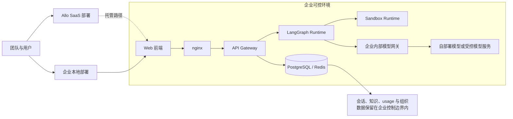
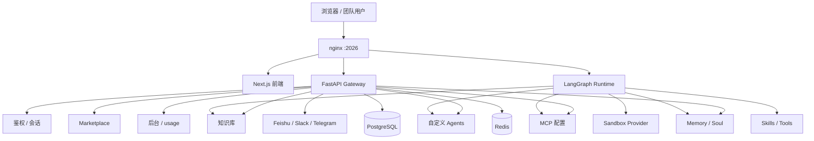

# Allo（元枢）

[English](./README.md) | 中文

[](./backend/pyproject.toml)
[](./Makefile)
[](./LICENSE)

Allo（元枢）是一个面向团队的 Web 端 AI 工作台与 SaaS 产品，用来处理调研、编程、分析和内容生成等多步骤任务。它把聊天线程、知识库、自定义 Agents、Marketplace、管理后台，以及可扩展的 Agent Runtime 组合在一个完整产品里。

Allo 同时支持 SaaS 交付和企业本地部署。对于有数据隐私、合规审查、网络隔离和内部治理要求的团队，可以把从模型接入到网关、运行时、存储、反向代理在内的整套服务部署在自己的环境中，在保留 Web 产品体验的同时，把数据路径控制在企业边界内。

> 产品品牌是 **Allo（元枢）**。当前仓库中的部分内部包名、脚本名和运行时模块，仍然保留历史 `deerflow` 命名。

## 部署与隐私概览



## 目录

- [Allo 是什么](#allo-是什么)
- [团队为什么选择 Allo](#团队为什么选择-allo)
- [核心产品能力](#核心产品能力)
  - [聊天与工作模式](#聊天与工作模式)
  - [知识库](#知识库)
  - [自定义 Agents](#自定义-agents)
  - [Marketplace](#marketplace)
  - [管理后台与团队运营](#管理后台与团队运营)
- [SaaS 与团队基础能力](#saas-与团队基础能力)
- [企业部署与数据隐私](#企业部署与数据隐私)
- [Agent 平台能力](#agent-平台能力)
- [系统架构](#系统架构)
- [快速开始](#快速开始)
  - [本地开发](#本地开发)
  - [Docker 开发](#docker-开发)
  - [生产风格 Docker 部署](#生产风格-docker-部署)
- [开发命令](#开发命令)
- [仓库结构](#仓库结构)
- [许可证](#许可证)

## Allo 是什么

Allo 同时面向两类读者：

- **团队与业务负责人**：需要一个支持账号、组织、知识、管理和扩展能力的 Web 端 AI 工作台
- **开发者与自托管团队**：需要这套产品背后的完整技术栈，包括前端、API Gateway、Agent Runtime、Sandbox、Skills、MCP、Memory 和渠道接入

落到实际能力上，Allo 提供：

- 面向长任务和复杂任务的 Web 工作台
- 基于组织作用域的数据隔离与会话鉴权
- 带规划、推理、工具调用和子代理能力的 Agent 编排
- 可扩展的 Skills 与 MCP 工具体系
- 知识库导入、索引与检索能力
- 同时适用于 SaaS 交付和企业自控部署的落地方式

## 团队为什么选择 Allo

Allo 介于“只能聊天的 AI 应用”和“完全碎片化的内部 AI 技术栈”之间。

它把下面这些能力放在一个统一产品面里：

- 多步骤 AI 工作，而不只是一次性提问
- 共享知识与可复用 Agents，而不只是个人对话
- 组织级管理与可见性，而不只是个人使用记录
- 通过 Skills、Tools 和 MCP 做扩展，而不是固定助手
- 在数据隐私、网络边界和合规要求更高时，提供企业可控的部署方式

对于企业用户，关键不只是“Allo 有这些产品能力”，而是“这套产品可以作为完整系统部署在企业自己的环境中”。

## 核心产品能力

### 聊天与工作模式

Allo 的工作台围绕持久化聊天线程和运行记录组织。当前提供三种工作模式：

- **Autonomous**：默认的端到端执行风格，适合复杂任务
- **Precise**：更强调控制感和明确交互的执行风格
- **Express**：更强调反馈速度和短回路执行的模式

这三种模式都保留规划、推理和子代理能力，差异主要在交互风格与运行预算，而不是能力阉割。

线程层面的能力还包括：

- 多模型选择
- 对支持的模型设置 reasoning effort
- 把文件上传到线程作用域存储
- 访问生成文件与 artifacts
- 生成后续追问建议
- 在聊天上下文中挂接知识库

### 知识库

Allo 提供组织作用域的知识库，用来为 Agent 工作提供业务上下文。

当前能力包括：

- 创建、读取、更新、删除知识库
- 上传不超过 50 MB 的文档
- 把支持的文件转换成 Markdown，供后续检索使用
- 按需触发索引，而不是导入后立刻全量嵌入
- 支持关键词检索与语义检索
- 读取处理后的内容，并下载原始文件

这让知识库既可以作为产品能力使用，也可以作为面向业务场景的 Agent 基础设施使用。

### 自定义 Agents

团队不必只依赖一个默认助手，也可以在工作台里定义自己的 Agents。

当前能力包括：

- 校验名称可用性与命名合法性
- 创建、读取、更新、删除自定义 Agents
- 为 Agent 单独配置模型
- 为 Agent 单独配置工具组
- 通过 `SOUL.md` 编辑 Agent 的人格与行为约束
- 为特定 Agent 提供独立聊天入口

这使团队可以把重复流程打包成具名 Agent，在同一工作台中持续复用。

### Marketplace

Allo 提供 Marketplace，用来安装可复用的 Skills 和 Tools。

当前能力包括：

- 浏览公开 Tools 与公开 Skills
- 以组织维度安装和卸载条目
- 为新创建的组织自动安装公开 Marketplace 条目
- 保存组织级安装记录
- 上传自定义 `.zip` 或 `.skill` 包
- 重新上传同名自定义 Skill 并覆盖安装
- 删除用户上传的自定义 Skill
- 在最终 Skill Catalog 之上叠加用户级启用 / 禁用开关

这让 Allo 同时具备平台分发能力和用户自定义能力。

### 管理后台与团队运营

Allo 已经具备面向产品的后台和团队管理能力，而不只是开发者 API。

当前能力包括：

- 平台级 usage 汇总接口
- 组织成员列表、添加、移除
- 组织级 usage 汇总接口
- 后台总览页面与组织页面
- 对鉴权请求记录 usage 数据

仓库中也已经具备更严格治理能力所需的基础，包括提供方密钥管理、组织感知的管理模型，以及 usage 可见性，这些能力可以继续向更完整的 SaaS 治理能力演进。

## SaaS 与团队基础能力

Allo 不是一个只做演示的 Agent 界面。当前代码已经包含 SaaS 化产品需要的核心基础能力：

- **鉴权与会话**：邮箱注册、登录、退出、基于 Cookie 的会话，以及当前登录态查询
- **组织模型**：用户归属组织，主要产品数据按 `org_id` 隔离
- **租户配置基础**：数据模型已经包含组织级配置记录
- **用户资料**：包含用户资料与 locale 处理
- **Usage Tracking**：中间件会把鉴权请求记录成 usage records
- **Provider Key 管理**：用户 API Key 管理接口为 BYOK 方向提供基础
- **Marketplace 安装模型**：Skills 和 Tools 可以按组织安装
- **渠道接入**：后端服务层可以管理 Feishu、Slack、Telegram 渠道

对外描述时，比较准确的总结是：

- Allo 已经覆盖团队 AI 工作台所需的核心产品面。
- 同时也具备继续扩展到更深层 BYOK、治理、租户配置和 usage 管理流程的技术基础。

## 企业部署与数据隐私

Allo 不只适合托管式 SaaS，也适合企业自控部署。

### 企业可控部署的范围

当前仓库已经支持把完整应用栈部署在企业自有环境中，包括：

- Web 前端
- API Gateway
- 基于 LangGraph 的运行时服务
- nginx 反向代理
- 基于 PostgreSQL 的应用数据存储
- 基于 Redis 的会话与缓存链路
- 与 Sandbox 相关的运行时组件
- 本地模式或容器模式的服务编排

这意味着企业可以把应用平面放在自己的环境中，而不是被迫把产品流量经过第三方托管控制面。

### 模型与服务的部署灵活性

Allo 的结构也允许企业控制模型侧链路。

你可以：

- 在 `config.yaml` 中配置自己的模型提供方
- 通过 `base_url` 指向 OpenAI 兼容网关
- 对接企业自己的模型中继或内部模型服务
- 把工作流服务、数据存储与模型访问都放在同一受控环境中

这也是 Allo 在数据隐私上的核心价值：它可以作为 SaaS 交付，但并不被锁死在 SaaS-only 的运行方式里。

### 数据隐私定位

对于数据敏感团队，真正重要的是部署控制权。

Allo 的设计允许组织：

- 把用户会话、组织数据、知识文件和 usage 记录保留在自己的基础设施内
- 把整套应用放在自己的网络边界之后运行
- 使用自己选择的模型与模型网关
- 在内部政策不允许时，避免把业务数据强制送入外部托管产品栈

如果你的诉求是“既要 Web 产品体验，又要企业可控的数据路径”，那这正是 Allo 当前代码结构支持的方向。

## Agent 平台能力

在 Web 产品层之下，Allo 仍然具备完整的 Agent 平台能力。

### Skills

Skills 是结构化能力模块，可以被打包、安装、启用、禁用和分发。

Allo 当前支持：

- 内置公开 Skills
- Marketplace 管理的 Skills
- 用户上传的自定义 Skills
- 用户级 Skill 开关
- 由底层运行时驱动的渐进式 Skill 加载

### MCP

Allo 提供用户作用域的 MCP 配置管理。

包括：

- 命名的 MCP Server 定义
- `stdio` 和远程服务相关配置字段
- Header 与环境变量配置
- OAuth 相关配置字段，例如 token URL、client credentials、refresh token、scope 和 audience

### Memory 与 Soul

Allo 把可复用的个人上下文与临时线程状态分开处理。

- **Memory** 用来保存长期上下文
- **Soul** 用来保存用户的人格与行为约束内容
- 运行时在执行前会预加载 memory、soul、知识库引用和 skill catalog 状态

### Sandbox、上传与 Artifacts

Allo 支持以文件为中心的 Agent 工作流，而不只是纯聊天。

- 上传文件到线程作用域存储
- 把支持的 Office 文件转换成 Markdown
- 在需要时把上传内容同步到运行时可见的 Sandbox 路径
- 通过 HTTP 接口暴露生成文件与 artifacts
- 通过 artifact 路由读取打包 Skill 的内容

### 规划与子代理

Allo 的底层运行时是为多步骤任务设计的，不只是单轮对话引擎。

它支持：

- 计划模式上下文
- 面向交互风格的运行配置
- 在线程上下文中启用子代理
- 递归执行预算
- 基于 LangGraph 的长任务编排

## 系统架构

Allo 是一套同时包含 Web 产品层和 Agent Runtime 层的全栈系统。

### 技术栈

- **前端**：Next.js 16、React 19、TypeScript
- **Gateway**：FastAPI
- **Agent Runtime**：基于 LangGraph 的运行时与内部 `deerflow` harness 包
- **存储**：PostgreSQL 应用数据与 Redis 会话 / 缓存链路
- **反向代理**：运行在 `2026` 端口的 nginx

### 本地运行布局

典型本地环境包括：

- **Frontend** 负责 Web 应用
- **Gateway** 提供 auth、knowledge bases、marketplace、admin、settings 等产品 API
- **LangGraph Runtime** 负责 Agent 执行
- **Sandbox Provider** 负责文件和代码执行环境
- **nginx** 把所有入口统一到一个本地访问地址

### 系统总览



## 快速开始

### 本地开发

在仓库根目录执行：

1. 检查环境依赖

   ```bash
   make check
   ```

2. 安装依赖

   ```bash
   make install
   ```

3. 生成本地配置文件

   ```bash
   make config
   ```

4. 配置模型与环境变量

   - 编辑 `config.yaml`
   - 编辑 `.env`
   - 至少配置一个可用模型
   - 补充对应提供方的 API Key

5. 启动完整本地栈

   ```bash
   make dev
   ```

6. 打开应用

   ```text
   http://localhost:2026
   ```

### Docker 开发

如果要使用基于 Docker 的开发环境：

```bash
make config
make docker-init
make docker-start
```

然后访问：

```text
http://localhost:2026
```

### 生产风格 Docker 部署

如果要在本地构建并运行生产风格 Docker 栈：

```bash
make up
```

停止命令：

```bash
make down
```

## 开发命令

### Backend

在 `backend/` 目录执行：

```bash
make lint
make test
make dev
make gateway
```

单测示例：

```bash
PYTHONPATH=. uv run pytest tests/test_model_factory.py -v
PYTHONPATH=. uv run pytest tests/test_model_factory.py::test_create_chat_model_with_valid_name -v
```

### Frontend

在 `frontend/` 目录执行：

```bash
pnpm lint
pnpm typecheck
pnpm dev
pnpm build
```

不要依赖 `pnpm check`，这里应分别执行 `pnpm lint` 与 `pnpm typecheck`。

如果是涉及鉴权或环境校验的生产构建，需要设置 `BETTER_AUTH_SECRET`。

### 全栈启动

在仓库根目录执行：

```bash
make dev
make stop
```

## 仓库结构

```text
backend/
  app/
    gateway/        FastAPI 产品 API：auth、threads、knowledge、marketplace、admin、settings
    channels/       Feishu / Slack / Telegram 渠道接入
  packages/harness/ 内部 Agent harness 包（`deerflow`）
  tests/            后端测试
frontend/
  src/app/          Next.js App Router 页面
  src/components/   产品组件与 UI 组件
  src/core/         前端数据层与产品逻辑
skills/public/      内置 Skills
scripts/            启动、配置与部署脚本
docker/             Docker 与 nginx 配置
```

## 许可证

MIT。
